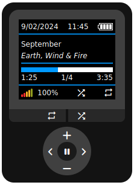

# codefiles
this reposity is just various small codes and solutions i've made

## html mp3 player
[live preview](snipchu.neocities.org/projects/mp3player)

### how to use:
* download ./2024/7_11_24 folder
* upload audio in folder
* add song information in 7_11_24.js
* to set default audio: replace September.mp3 in index.html
